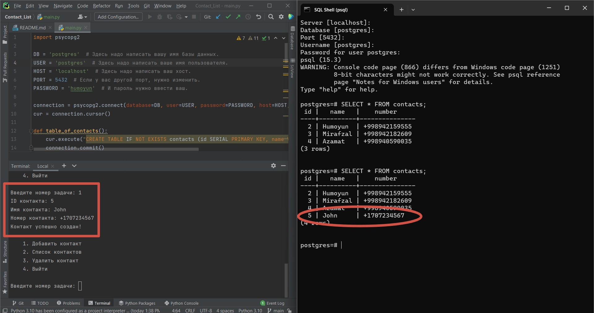

# Contact_List


##  Контактный список (Contact List) с использованием PostgreSQL и Psycopg2

> Программа представляет собой простое приложение для создания и управления контактами. Контакты хранятся в базе данных PostgreSQL. Пользователь может добавлять, просматривать и удалять контакты.



**Пример программы так работает.**


## Зависимости

**Для работы программы требуется установить библиотеку psycopg2. Убедитесь, что PostgreSQL установлен и запущен на вашем компьютере.**


## Установка

1. Установите Python (версия 3.11.4) на ваш компьютер.

2. Клонируйте репозиторий с GitHub:
    ```bash
    $  git clone git clone  https://github.com/Humoyun004/Contact_List.git
    ```
3. Перейдите в директорию с программой:
cd Contact_List

## Настройка

1. Замените значения переменных DB, USER, HOST, PORT и PASSWORD на ваши собственные данные (имя базы данных, имя пользователя, хост, порт и пароль).
2. Создайте таблицу контактов в базе данных, запустив функцию table_of_contacts().
3. Запустите программу, выполнив функцию main().

## Описание функций

1. **table_of_contacts()**:Создает таблицу contacts в базе данных, если она еще не существует. Таблица содержит столбцы id, name и number.

2. **add(id: int, name: str, contact: str)**:Добавляет новый контакт в таблицу contacts. Пользователь указывает ID контакта, имя и номер телефона.

3. **list_of_contacts()**:Выводит список всех контактов из таблицы contacts. Если список пуст, выводится сообщение об этом.

4. **delete(name: str)**:Удаляет контакт из таблицы contacts по указанному имени.

5. **main()**:Основная функция программы. Выводит пользовательское меню с доступными опциями: добавить контакт, просмотреть список контактов, удалить контакт или выйти из программы.      
 

## Использование
1. Запустите программу и следуйте инструкциям в меню.
2. Для добавления контакта, выберите опцию "1" и введите ID, имя и номер контакта.
3. Для просмотра списка контактов, выберите опцию "2".
4. Для удаления контакта, выберите опцию "3" и введите имя контакта, который нужно удалить.
5. Для выхода из программы, выберите опцию "4".

**Программа позволяет управлять контактами, добавлять новые и просматривать существующие контакты. Все контакты сохраняются в базе данных PostgreSQL, что обеспечивает их сохранность между запусками программы.**


## Вклад
**Если вы хотите внести свой вклад в развитие приложения "Contact List", пожалуйста, следуйте этим шагам:**

1. Форкните репозиторий на GitHub.
2. Клонируйте ваш форк репозитория на локальную машину.
3. Создайте новую ветку для вашей функции или исправления ошибки.
4. Внесите изменения и сделайте коммиты с описательными сообщениями.
5. Отправьте ваши изменения в ваш форк репозитория.
6. Создайте pull request (запрос на включение) в основной репозиторий.


## Контакты
**Если у вас есть вопросы или предложения относительно приложения "Contact List", пожалуйста, свяжитесь с нами по адресу humoyunakbaraliev1@gmail.com. Мы ценим ваше мнение!**


